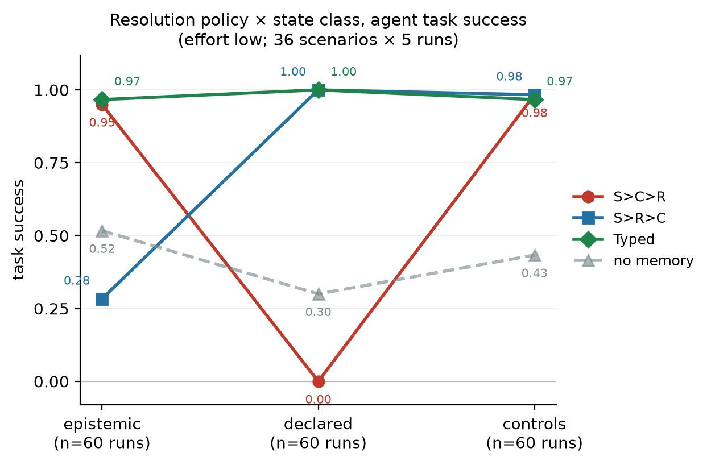
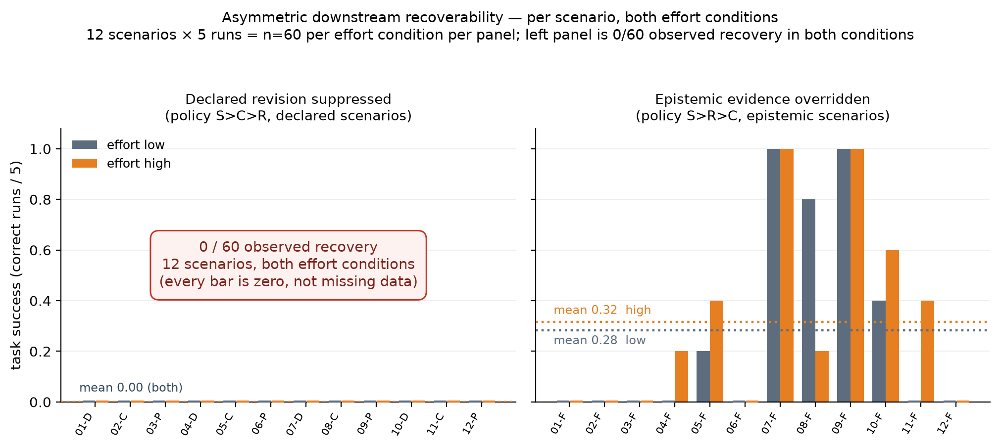

# One Order Is Not Enough: Typed Resolution for Declared and Epistemic Memory

**Draft — workshop / short paper.** Evidence frozen; no experiment is pending.

---

## Abstract

Agent memory systems accumulate records that conflict. The usual remedy is a
single global precedence order over signals such as source authority,
confidence and recency, applied uniformly to every record. We show that this
cannot work when records carry different state semantics. On a frozen set of 12
reversal pairs and 12 controls, we exhaustively evaluate all six permutations of
(source, confidence, recency) plus three single-dimension policies and two
baselines. **Every evaluated fixed policy resolves exactly half of the reversal
scenarios.** Among the six complete permutations, `S>C>R` and `S>R>C` are the
only two that retain all 12 controls, and they fail on complementary halves:
source-then-confidence-then-recency is
correct on all 12 epistemic cases and none of the 12 declared cases, and
source-then-recency-then-confidence is correct on exactly the reverse. A typed
policy that selects resolution semantics per state class is correct on all 24. We
then show the split is not confined to the resolver: handing each policy's
resolved state to an agent on a decision task (36 scenarios × 4 policies × 5
runs), task success reproduces the same interaction, and wrong memory yields
lower aggregate success than no memory on the affected class, although the
scenario-level direction is heterogeneous. We additionally observe a
directional asymmetry: agents sometimes recover from incorrect epistemic
resolution, but no recovery was observed in 60 runs when a declared revision was
suppressed. The
interaction persists when agent reasoning effort is increased from low to high.

---

## 1. Introduction

A long-lived agent accumulates records about its user and environment, and those
records disagree. A deadline is set and then moved. A service is observed running
one database and later reported running another. A preference is stated, then
revised. Something must decide which record governs.

The common answer is a fixed precedence order. Prefer the more authoritative
source; among equals prefer the more confident record; among those prefer the
more recent. The order is chosen once and applied to everything.

This paper is about a case where that cannot be made to work. The difficulty is
not that the order is badly chosen. It is that two kinds of record impose
opposite requirements on the same comparison.

Consider two conflicts with identical structure — same source authority, the
incoming record newer, the incoming record recorded with lower confidence:

> **Epistemic.** A monitoring report says the orders service runs on PostgreSQL,
> recorded with high confidence. A newer, hedged remark suggests it may be
> MySQL. The better-evidenced record should stand.

> **Declared.** A deadline is recorded as Friday, with high confidence. The user
> replies "tues 24th, actually" — terse, context-dependent, recorded with lower
> confidence. The revision should govern.

The conflicts are indistinguishable on source, recency and confidence. They
differ only in what the record *is*: a claim about the world, or a record of an
act. Any ordering that ranks confidence above recency gets the first right and
the second wrong; any ordering that ranks recency above confidence does the
reverse.

We make two primary claims and report one secondary observation.

1. **No fixed global ordering resolves both declared and epistemic memory
   semantics.** Established deterministically and exhaustively over the
   dimensions enumerated (§5).
2. **Typed resolution resolves both, and prevents the deterministic conflict
   from propagating downstream.** Established at the resolver and then in agent
   behaviour (§5, §6).

We also observe that the two error directions are not equally harmful, and mark
that observation's explanation as unconfirmed (§7).

**What this paper does not claim.** That every memory type needs a bespoke
policy — an earlier phase of this work found a fixed source ranking sufficient
for provenance conflicts, so provenance is not the contribution. That the
declared/epistemic distinction is a schema; here it is an analytical taxonomy
over an unchanged system. That the result generalises beyond the tested state
classes, one model, and one task distribution.

---

## 2. Related work

**Agent memory systems.** Representative agent-memory systems primarily study
memory tiering, organization, indexing, retrieval, and evolution. MemGPT
[1] treats context as a memory hierarchy managed like an operating
system's, paging information in and out of a bounded window. A-MEM [2]
builds an agentic memory that indexes, links and evolves notes as the agent
accumulates them. We instead isolate the conflict-resolution step after records
have already been retained: retrieval is held fixed, and the question is which of
two retained records governs.

**Belief revision and temporal databases.** Belief revision formalizes how a
belief set should change under new information [3], while temporal
databases distinguish when a fact is valid from when it is recorded
[4]. These traditions motivate treating update semantics explicitly, but
neither distinction is identical to the declared/epistemic split studied here.
Valid time and transaction time separate two clocks; our split separates two
*kinds of content* — a claim about the world and a record of an act — which may
share both clocks.

**Truth discovery and source trust.** Truth-discovery methods infer values and
source reliability jointly from conflicting claims [5]. Our reversal
pairs hold source authority equal by construction, making the unresolved
distinction semantic rather than source-dependent: no amount of source modelling
separates a hedged observation from a terse revision when both come from the same
source.

**Agent-memory benchmarks.** Existing benchmarks commonly report end-to-end
memory QA, retrieval, or ranking performance. LoCoMo [6] evaluates very
long-term conversational memory, and LongMemEval [7] benchmarks chat
assistants on long-term interactive memory. We hold retrieval fixed and score the
resolver deterministically before exposing only its selected payload to the
agent, so a behavioural difference is attributable to the resolution policy
rather than to what was retrieved.

**Closest prior work.** MemConflict [8] is the nearest study: it evaluates
long-term memory systems under temporal, factual and contextual conflicts, with
white-box retrieval and ranking diagnostics. Our study asks a different, narrower
question — whether one fixed precedence order can satisfy two state semantics
when source, confidence and recency are controlled — and then isolates how the
resolver's choice propagates into downstream action. Where MemConflict
characterises how systems behave across conflict types, we construct pairs that
are identical on every ranking signal and differ only in state semantics, so that
a fixed ordering is forced to choose between them.

**Provenance is not the contribution.** In our preceding Phase 1, a fixed source
ranking was sufficient for the tested provenance conflicts; we therefore exclude
provenance from the present contribution. That experiment is a frozen report in
the accompanying artifact, not a published result.

---

## 3. Declared and epistemic state

We use one distinction, and it is narrower than a general type system.

**Epistemic state** answers *what is currently true?* Multiple records offer
evidence about one standing question. Among records of equal source authority,
confidence legitimately ranks competing observations: a newer but less faithfully
captured observation does not automatically displace stronger existing evidence.

**Declared state** answers *what has the actor decided, committed to, or
revised?* Once a later declaration is admitted as a valid record of the actor's
act, the confidence attached to the older record cannot permanently prevent the
new declaration from governing.

**Confidence** has exactly one meaning throughout: *the recorder's certainty that
the record faithfully captures what its source conveyed.* It covers the right
slot, the right value, the right contextual binding, and hedging carried from the
source. It is not the system's posterior probability that the state is true, not
source authority, and not aggregated evidence strength. A lower-confidence
explicit revision is admitted only when the scenario text earns it — a terse
reply whose referent must be resolved from context is less certainly *recorded*,
though the fact that a revision occurred is not in doubt.

The hypothesis is correspondingly narrow:

> A single confidence-versus-recency ordering may be insufficient across
> epistemic and declared state.

---

## 4. Setup

**Scenarios.** 12 reversal pairs (24 scenarios) and 12 controls, across six
domains: infrastructure, scheduling, coding policy, travel, team workflow, and
personal profile. Each pair holds source class equal, makes the incoming record
newer, sets confidence 0.9 against 0.6, and varies only the state class. Every
incoming record clears the admission floor of 0.5. Deadlines move *earlier*, so
gold never coincides with "choose the latest date"; a `nomem_predicted` label is
registered per scenario, and only two controls are intentionally aligned with the
model's no-memory default. Controls cover same-source-newer-and-more-confident,
lower-priority incoming source, verified operational results, and no-conflict
agreement.

**Policies.** All six permutations of (source, confidence, recency), three
single-dimension policies, two prior baselines, and `Typed`, which applies
per-state-class semantics frozen before any scenario was written.

**Agent stage.** The resolved governing record is rendered as bare content and
given to a fixed model behind a fixed prompt with a closed action set. Only the
memory payload differs between policies. `claude-sonnet-5`, one prompt version,
structured JSON output with the action constrained to the task's choices, five
repetitions per cell.

**Two controls on the experiment itself.** An **oracle** arm receives the gold
governing state, to establish the decision task is solvable at all; it had to
reach 0.95 overall with no class below 0.90 before any comparative run was
permitted. A **no-memory** arm receives no memory payload, to detect answer
leakage from task context and to test whether wrong memory is worse than absent
memory.

**Ordering.** The semantics table, the scenarios, the predictions and the verdict
rules were each committed before the next existed, and before any result was
seen.

---

## 5. The deterministic result

Eleven fixed policies, evaluated at the resolution stage with no model in the
loop.

**Table 2.** Governing-state accuracy on the 12 reversal pairs by state class,
and on the 12 controls.

```text
policy      epistemic   declared    pairs   controls
──────────────────────────────────────────────────────
S>C>R          12/12       0/12     12/24      12/12
S>R>C           0/12      12/12     12/24      12/12
C>S>R          12/12       0/12     12/24       8/12
C>R>S          12/12       0/12     12/24       8/12
R>S>C           0/12      12/12     12/24       7/12
R>C>S           0/12      12/12     12/24       7/12
S_only          0/12      12/12     12/24      12/12
C_only         12/12       0/12     12/24       8/12
R_only          0/12      12/12     12/24       7/12
b0              0/12      12/12     12/24       7/12
b_scd           0/12      12/12     12/24       7/12
──────────────────────────────────────────────────────
Typed          12/12      12/12     24/24      12/12
```

Three things follow.

**Every evaluated fixed policy scores exactly 12 of 24.** Not approximately, and not with
one ordering edging ahead. The set partitions cleanly: each fixed ordering is
perfect on one state class and empty on the other.

**Among the six complete permutations, `S>C>R` and `S>R>C` are the only two that
retain all 12 controls.** Every other permutation loses four or five. `S_only`
also keeps 12/12, but it is a single-dimension policy rather than a complete
ordering over the three signals, so it does not disturb the comparison — it is
reported here because the qualifier matters: the claim is about complete
permutations, not about every policy evaluated.

So the split is not a contrivance between two arbitrary policies. It is where the
strongest complete orderings fail, and they fail on complementary halves.

**The typed policy is correct on all 24 and all controls.** It is the only
policy in the set that is.

This is a deterministic, exhaustive statement over the three dimensions actually
enumerated. No model is involved, so nothing here is about reasoning.

---

## 6. Downstream propagation

A resolver result is not yet a behavioural result. We give each policy's resolved
state to an agent on a decision task: 36 scenarios × 4 policies × 5 runs = 720
calls, one model, one prompt, one scorer.

The oracle gate passed first: 0.97 overall, 0.98 epistemic, 0.92 declared, 1.00
controls. One labelling defect was corrected between the gate and the comparative
run — a scenario worded so that the oracle read a date as *today's* date in 5/5
runs, which meant no policy could have been distinguished on it. The gold was
unchanged, the pre-correction gate result is preserved, and the oracle re-ran
5/5. No scenario was touched after a comparative result existed.

**Table 3.** Governing-state accuracy and task success.

```text
                governing state          task success
policy       epist  decl  ctrl  │   epist  decl  ctrl   all
S>C>R         1.00  0.00  1.00  │    0.95  0.00  0.98  0.64
S>R>C         0.00  1.00  1.00  │    0.28  1.00  0.98  0.76
Typed         1.00  1.00  1.00  │    0.97  1.00  0.97  0.98
nomem         0.00  0.00  0.00  │    0.52  0.30  0.43  0.42
```

**Figure 1** plots the policy × state-class interaction in task success. The two
fixed orderings cross between the epistemic and declared columns; `Typed` runs
flat along the top, and the no-memory arm sits well below every memory-bearing
policy on the classes those policies get right.



*Figure 1. Resolution policy × state class, agent task success, effort low.
n = 60 runs per cell (12 scenarios × 5 repetitions).*

The deterministic split propagated into downstream agent task performance. Of
217 failed runs, 207 are attributed to a wrong governing state and 9 to a correct
state with a wrong agent decision — inside the pre-registered threshold of 0.10,
which did not trigger. Controls stay flat across memory-bearing policies.

**Wrong memory produced lower observed task success than no memory on the
affected class.** `S>C>R` reaches 0.00 on declared against no-memory's 0.30, and
`S>R>C` reaches 0.28 on epistemic against 0.52.

These aggregates pool five repetitions within each of 12 scenarios, so the 60
calls behind each cell are not 60 independent samples. A scenario-level paired
view is therefore reported alongside, as **descriptive and exploratory**:

```text
wrong policy vs no-memory, per scenario (12 each)      worse   tie   better
S>C>R on declared      low effort                          4     8        0
                       high effort                         4     8        0
S>R>C on epistemic     low effort                          7     3        2
                       high effort                         7     1        4
```

The direction is not uniform, and the two classes behave differently. On declared
state no scenario favours the wrong policy in either arm, but eight of twelve are
ties in which the no-memory arm also fails — so the aggregate difference rests on
four scenarios. On epistemic state the majority favours no-memory, with two to
four scenarios running the other way. The aggregate comparison is real in
direction; it is not a uniform per-scenario effect, and we do not claim a
calibrated effect size for it.

**What this is not.** The agent did not rediscover the conflict. Resolution
happens upstream and deterministically, and the agent receives only the winning
record, as bare content, with no identifiers and no sight of the record that
lost. It cannot rediscover what it was never shown, and we therefore describe the
result as propagation, not replication.

---

## 7. Secondary observation: asymmetric recoverability

**Result.** The two error directions differ sharply in how often the agent still
reaches the correct action.

```text
error direction                                low effort   high effort
suppress a valid declared revision                  0.00         0.00
override better-evidenced epistemic state           0.28         0.32
```

No recovery was observed in 60 runs when a declared revision was suppressed, at
either effort level. Overriding better-evidenced epistemic state was recoverable
in roughly three runs in ten. Suppressed declared revisions therefore appeared
substantially less recoverable in the tested scenarios, and the pattern is stable
across the robustness run of §8.

0/60 is a strong observation, not a demonstration that the true recovery
probability is zero: with 60 runs the upper bound on an unobserved rate remains
appreciable, and the scenarios are 12, not 60, independent items.

One consequence is that the behavioural gap *under-states* the resolution gap on
epistemic state. At the resolver, `S>R>C` is wrong on 12 of 12 epistemic cases;
in behaviour it still succeeds 28–32% of the time.

**Candidate explanation.** One plausible explanation is that linguistic
uncertainty cues remained visible in the selected payload, and an agent acting on
the hedge rather than on the hedged claim can still reach the right action. A
suppressed declared revision leaves no comparable trace: the superseded value is
simply asserted, with nothing in the payload signalling that it was revised.

**Boundary.** The current protocol did not measure whether the agent noticed or
used those cues. The response format captured a free-text field that entered no
scoring path, so the explanation above is an interpretation of an outcome
differential, not an observation of a mechanism. It is a hypothesis this work
generates, not one it confirms.

If the asymmetry holds under a designed test, it suggests a directional design
rule — a system may tolerate being wrong about what is true more readily than
being wrong about what was decided — but that rule is not established here.
§11 specifies the experiment that would establish it.

**Figure 2** plots both error directions per scenario at both effort levels, so
the aggregate is not the only thing visible.



*Figure 2. Per-scenario task success under each error direction, both effort
conditions. n = 60 per effort condition per panel (12 scenarios × 5 runs). The
left panel is empty: 0/60 observed recovery in both conditions. The right panel
shows the heterogeneity behind the 0.28/0.32 aggregates — two scenarios recover
in 5/5 runs, several in none — which is why the asymmetry is reported as an
observation about the tested scenarios rather than as a calibrated rate.*

---

## 8. Robustness

The agent stage used the lowest-variance configuration available: sampling
controls are not request parameters on this model generation, so thinking was
disabled and reasoning effort set low, with run-to-run variance handled by
repetition. This invites an obvious objection: the interaction might be an
artefact of running the model too cheaply.

We ran one single-axis robustness check. Effort moved from low to high.
Everything else was held: the same 36 scenarios, four policies, five
repetitions, scorer, prompt, output schema, model and token limit. Enabling
extended thinking was considered and is not available for this model, so effort
is the only stronger axis it exposes. The configuration was frozen and committed
before any call, with the readout restricted in advance to two questions.

**Table 4.** Task success, both arms.

```text
             low effort              high effort
policy    epist  decl  ctrl       epist  decl  ctrl
S>C>R      0.95  0.00  0.98        0.98  0.00  1.00
S>R>C      0.28  1.00  0.98        0.32  1.00  0.98
Typed      0.97  1.00  0.97        1.00  1.00  0.98
nomem      0.52  0.30  0.43        0.53  0.32  0.55
governing-state accuracy: identical in both arms
```

The interaction persists and sharpens. `Typed` reaches 1.00/1.00. `S>C>R`
holds at 0.00 on declared: **no recovery was observed after increasing the
model's effort setting from low to high.** `S>R>C`
epistemic rescue rises slightly, 0.28 → 0.32. Controls stay flat. Failures
attributed to a correct state with a wrong decision fall from 9 to 3.

**The interaction is robust to this single-axis increase in reasoning effort.**
That excludes the narrow explanation that the interaction appears only at low
effort. It does not exclude every shallow-reasoning account: `effort` is one
configuration axis, not a direct measure of reasoning depth, and extended
thinking was unavailable to test as a second axis. The run is not a replication
and adds no statistical power — same scenarios, same model, one axis moved.

---

## 9. What the evidence establishes

| # | Status | Claim |
|---|---|---|
| 1 | **Supported** | No fixed global ordering resolves both declared and epistemic memory semantics. |
| 2 | **Supported** | Typed resolution resolves both, and prevents the deterministic conflict from propagating downstream. |
| 3 | **Robustness** | The downstream interaction persists under increased reasoning effort. |
| 4 | **Observed** | Resolution errors exhibit asymmetric downstream recoverability. |
| 5 | **Not established** | That visible uncertainty cues explain the partial epistemic recovery. |
| 6 | **Not established** | Generalisation to a second model or a wider task distribution. |

---

## 10. Limitations

**A second model was not run, and this is compliance rather than omission.** The
pre-registered gate unlocking a second-model replication required both a drop in
the degenerate-output rate and a surviving interaction. Only the second occurred.
We note that the gate's premise is arguably obsolete — the degeneracy turned out
to be stable across configurations and harmless to every result — but acting on
that after seeing the data it was written to judge is precisely the post-hoc move
the protocol exists to prevent. Changing it requires a dated amendment with an
outcome-independent justification.

**A diagnostic field was uncontracted.** The response format included a free-text
`reason` field. A static audit found it reaches no scoring path: it is written,
stored, and read by nothing. In ~13% of runs it degenerated to a literal filler
token, at both effort levels, and in roughly four of five such runs the action
was nonetheless correct. Because it is in no scoring path, its degeneracy cannot
have affected any result reported here. It is a diagnostic-contract defect — the
field was declared to carry diagnostic weight and given no contract to carry it
with — and it is already a measurement defect for §7's explanation. A versioned
replacement protocol with grounded citations has been designed and tested but not
run; it is future measurement design, not a result of this paper.

**Counts, not statistics.** One model, one prompt, closed action sets, five
repetitions per cell. Effects are large and deterministic at the resolver; the
behavioural numbers are rates over small cells and are reported as such.

**Same hands.** The semantics table, the scenarios and the system were authored
by the same people. The table was argued without reference to the implementation
and frozen first, and the exhaustive falsifier and the oracle gate are the
checks — but they are not independent review.

**Scope.** The claim is scoped to the tested state classes, scenarios, model and
task distribution. The declared/epistemic split is an analytical taxonomy, not a
schema change; no system change follows from this paper.

---

## 11. Future work

The asymmetry in §7 is the natural next experiment, and it should be built to
test the explanation directly rather than to accumulate more of the same
evidence. A design that would qualify:

- **Manipulate the cue, hold the content.** Matched scenarios identical in every
  respect except the presence of an explicit uncertainty cue in the surviving
  record.
- **Fix the wrong state as input.** The agent receives an incorrectly resolved
  governing state by construction, so recovery rate is the dependent variable
  rather than a by-product of resolution accuracy.
- **Keep the loser hidden.** The agent sees one record, as here, so recovery
  cannot come from comparing candidates.
- **Pre-register the recovery-rate difference**, with the effect size and
  stopping rule fixed in advance.
- **Replicate on at least a second model.**

Only that would license promoting "visible uncertainty cues enable recovery"
from candidate explanation to mechanism. It requires a new response protocol and
a new stimulus condition, and its results would not be poolable with the
experiments reported here — which is why it is named as future work rather than
appended to this paper.

---

## Reproducibility

**Naming.** The typed policy is written `Typed` throughout this paper; its
identifier in the code and in every committed artifact is `b_typed`. The fixed
orderings keep their code names (`S>C>R`, `S>R>C`, …), and `S_only`, `C_only`,
`R_only`, `b0` and `b_scd` appear as they do in the results file.

**Model and configuration.** `claude-sonnet-5` via the Anthropic Messages API,
SDK `anthropic` 1.5.0. Sampling controls (temperature, top-p, top-k) are not
request parameters on this model generation, so the lowest-variance
configuration available was used instead: extended thinking disabled, output
effort `low` for the main run and `high` for the robustness run, `max_tokens`
300, structured JSON output with the action constrained by an enum to the task's
choices. Retries and timeouts were the SDK defaults (`max_retries = 2`;
connect 5 s, read/write/pool 600 s); transport-level retries were not
instrumented, so the reported 720 calls are logical calls and the number of HTTP
attempts may be higher. Prompt version `mode-b-pilot-0`; the system prompt is
483 characters and unchanged across both runs.

**Model snapshot: exact identifier unavailable.** The runner recorded the model
alias, and the transcripts retain no per-response metadata, so no dated snapshot
can be recovered from the artifacts; the API also echoed the alias rather than a
dated identifier when queried. We therefore report what is actually known and do
not infer a snapshot: alias `claude-sonnet-5`, SDK `anthropic` 1.5.0, oracle gate
run 2026-09-14, comparative run 2026-09-15, robustness run 2026-09-19, all UTC
timestamps committed with the artifacts. Future runs should capture the `model`
field of each response.


Every artefact is committed in order, each before the next existed: the
semantics table; the frozen scenarios; the predictions and verdict rules; the
exhaustive resolution results; the oracle gate; the comparative raw responses;
the analysis; the robustness configuration; the robustness raw responses; the
robustness analysis. Raw model responses for both agent-stage runs are stored
verbatim and were not modified after commit. The one labelling correction, its
justification, and the pre-correction gate result are recorded in the
predictions file.

---

## References

[1] C. Packer, S. Wooders, K. Lin, V. Fang, S. G. Patil, I. Stoica, and
J. E. Gonzalez. *MemGPT: Towards LLMs as Operating Systems.*
arXiv:2310.08560. https://arxiv.org/abs/2310.08560

[2] W. Xu, Z. Liang, K. Mei, H. Gao, J. Tan, and Y. Zhang. *A-MEM: Agentic
Memory for LLM Agents.* arXiv:2502.12110. https://arxiv.org/abs/2502.12110

[3] C. E. Alchourrón, P. Gärdenfors, and D. Makinson. *On the Logic of Theory
Change: Partial Meet Contraction and Revision Functions.* The Journal of
Symbolic Logic, 50(2):510–530, 1985. doi:10.2307/2274239

[4] R. T. Snodgrass. *Temporal Databases.* In Theories and Methods of
Spatio-Temporal Reasoning in Geographic Space, LNCS 639, Springer, 1992.
https://rts.cs.arizona.edu/pubs/LNCS639.pdf

[5] X. Yin, J. Han, and P. S. Yu. *Truth Discovery with Multiple Conflicting
Information Providers on the Web.* IEEE Transactions on Knowledge and Data
Engineering, 20(6):796–808, 2008. doi:10.1109/TKDE.2007.190745

[6] A. Maharana, D.-H. Lee, S. Tulyakov, M. Bansal, F. Barbieri, and Y. Fang.
*Evaluating Very Long-Term Conversational Memory of LLM Agents.* ACL 2024.
https://aclanthology.org/2024.acl-long.747/

[7] D. Wu, H. Wang, W. Yu, Y. Zhang, K.-W. Chang, and D. Yu. *LongMemEval:
Benchmarking Chat Assistants on Long-Term Interactive Memory.*
arXiv:2410.10813. https://arxiv.org/abs/2410.10813

[8] Z. Tao, J. Zhao, P. Liu, D. Xi, Y. Chen, W. Xu, and Z. Li. *MemConflict:
Evaluating Long-Term Memory Systems Under Memory Conflicts.* arXiv:2605.20926,
2026. https://arxiv.org/abs/2605.20926
